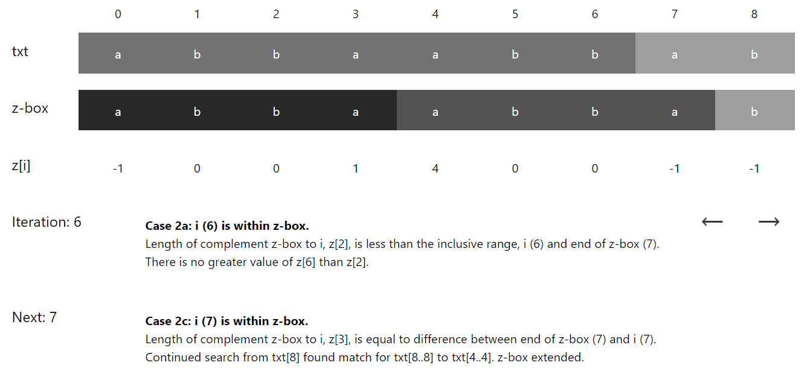

# Z-Algorithm Visualised

## About this App
I built this application as a first step towards understanding web technologies and the process from design to production. The idea to make a visualisation for this algorithm came from this [Suffix Tree Visualisation](http://brenden.github.io/ukkonen-animation/) of Ukkonen's algorithm. I'm excited by the sheer deviousness of some algorithms and am intrigued by the idea that we can still find ways to teach and learn them better. This project was a happy marriage of all of these things 😄

## Building
```
git clone https://github.com/asherLZR/z-algorithm-visualised/
cd z-algorithm-visualised
npm install

# Build and run server
npm run build
npm run start
```

## The Algorithm
Gusfield's Z-algorithm is a linear run-time algorithm that produces z[i] values, the length of the longest possible substring pat[i..i+z[i]-1] that matches the prefix, pat[0..z[i]-1]. It may be used for pattern matching. By prepending the pattern to the start of the text delimited by an unused character, we may traverse the resultant array for any z[i] values == length of pattern. Note that z[0] is obviously uninteresting, so we ignore its computation. 

The Z-algorithm is also used as a pre-processing step on the pattern as input to KMP and Boyer-Moore.

## Conceptual Understanding
The algorithm works with the idea of a sliding window. Whenever a new substring matching a prefix is found, we have more information to use at the next iteration so we avoid unnecessary comparisons.

Concretely, at any index `i` at run-time, we know the right-most position `r` found of any substring starting from any of `[1..i-1]` matching the prefix. Building on this, we define Z-boxes as 2 pointers on the string which denote a substring `[l..r]`, where `l` is the corresponding left index to `r`. In other words, Z-box `txt[l..r]`, matches the prefix `txt[0..Z[r-l]]`

### Case 1: `i > r`
If `i` extends past the known Z-box, we have no previous Z-values corresponding to `i` so we perform a linear search.


> In the subsequent cases, `i <= r`  
> → `txt[l..r] == txt[0..Z[r-l]]`  
> → `txt[l..i] == txt[0..i-l]`  
> so we can tap onto the information found at `Z[i-l]` to inform the computation of `Z[i]`!!!

### Case 2a: `i <= r and Z[i-l] < (r-i) + 1`
The corresponding Z-box starting at `i-l` extends no further than the length from `i` to the end of the current Z-box. Therefore, there is no greater `Z[i]` than `Z[i-l]`.


### Case 2b: `i <= r and Z[i-l] > (r-i) + 1`
Here, we draw up the following definitions:

> `X == txt[r+1]`  
> `Y == txt[r-l+1]`  
> `Z == txt[Z[i-l] + 1]`

Since `Z != Y != X`, there is no greater `Z[i]` than `r-i+1`.


### Case 2c: `i <= r and Z[i-l] == (r-i) + 1`
Similar to case 1, from `txt[r+1]` onwards, we now have no previous information to use so we begin linear search from `txt[r+1]`.


